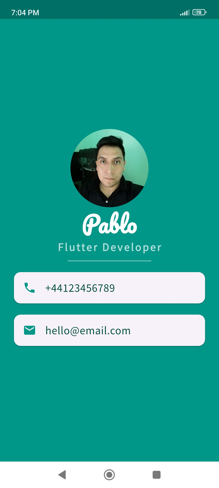

# 💳 Mi Card - My First Flutter App

This is my very first mobile app built with Flutter, created as part of a Flutter development course.

## 📚 About the Project

**Mi Card** is a digital business card app that show basic contact information.

## 🎯 Course Objective

This project focusing on **designing user interfaces** using Flutter's layout system.

## 🚀 What I Learned

By creating this app, I learned:

- ✅ How to create **Stateless Widgets**
- 🔁 The difference between **hot reload**, **hot refresh**, and **cold start**
- 🧱 How to use **Containers** to layout UI
- 🧭 How to use **Columns and Rows** for positioning
- ✍️ How to add and use **custom fonts**
- 🎨 How to use **Material Icons**
- 🖋️ How to **style Text widgets**
- 📖 How to **read and understand Flutter documentation**

---

## 🖼️ App Preview

 *Home screen*
 
 

---

## 🛠️ Built With

- [Flutter](https://flutter.dev/)
- [Dart](https://dart.dev/)

---
